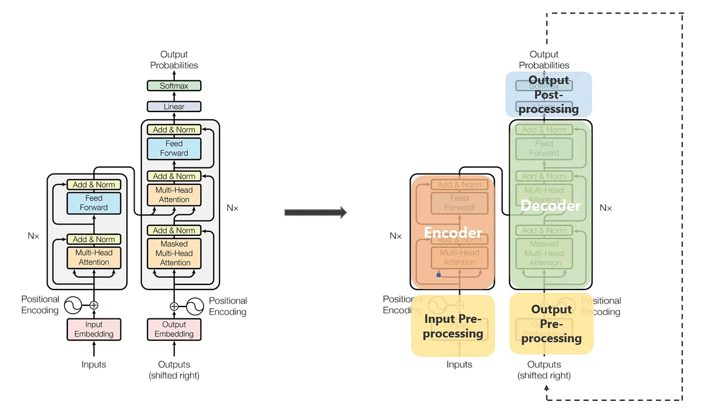
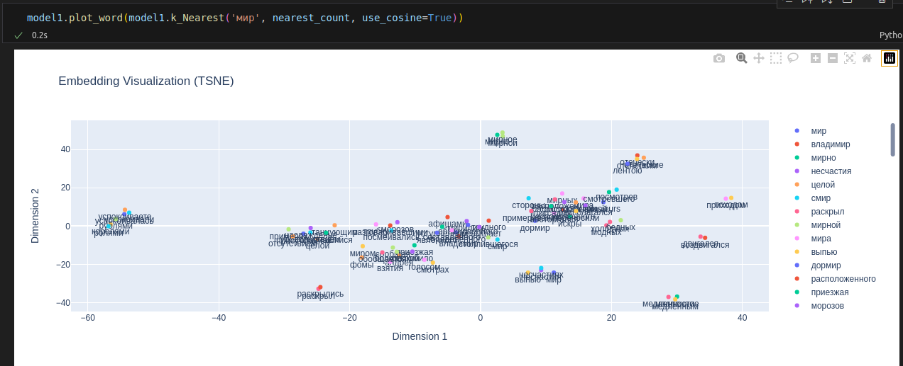

# Word and Text Embeddings

## Введение

Недавно увлекся темой эмбеддингов, и решил подробно изучить методы обучения эмбеддингов слов и текстов с их модификациями. Каждая модель написана собственно-ручно для лучшего понимания, что у них под капотом. Также будет описание за что и как отвечает каждый слой модели и особенности модели.

### Модели для обучения эмбеддингов слов:

- Word2Vec
    1) Skip-Gram
    2) CBOW
- FastText
- GloVe

### Модели для обучения эмбеддингов слов и текста одновременно:

- Tranformers
    1) BERT (Encoder)
    2) GPT (Decoder)
    3) T5 (Encoder + Decoder)

## Модификации класссических методов

У первой тройки реализовал такие методы, как:
1. Negative Sampling
2. Hierarhical Softmax: реализовано на сбалансированном бинарном дереве

## Реализация, описание и тест моделей

### Токенизаторы

Реализация:

1) [Реализация обычного токенизатора](./tokenizer/simple_tokenizer.py)  
2) [Реализация токенизатора, разбивающего на n-gramm-ы (FastText)](./tokenizer/fasttexttokenizer.py)

Тест и описание работы моей реализации:

1) [Тест и описание обычного токенизатора](./test/test_tokenizer.ipynb)  
2) [Тест и описание токенизатора, разбивающего на n-gramm-ы (FastText)](./test/test_fasttext.ipynb)

### Word2Vec

Реализация: [Общая реализация модели](./model/Word2Vec)

Тест и описание работы моей реализации: [Тест и описание работы Word2Vec](./test/test_wv.ipynb)

#### CBOW (Continuous Bag of Words)
[Реализация составления датасета для CBOW](./model/Word2Vec/wv_types/CBOW/cbow.py)

#### Skip-Gram
[Реализация составления датасета для Skip-Gram](./model/Word2Vec/wv_types/SkipGram/skipgram.py)

### FastText
[Реализация модели](./model/FastText/fasttext.py)

### GloVe (Global Vectors)
[Реализация модели](./model/GloVe/model.py)

### Transformers
Реализация: [Реализации Encoder, Decoder и их составляющих](./model/Transformers/model)  

#### BERT (Bidirectional Encoder Representations from Transformers)
Реализация: [Реализация модели](./model/Transformers/bert.py)

#### GPT (Generative Pre-trained Transformer)
Реализация: [Реализация модели](./model/Transformers/gpt.py)  
Тест и описание работы моей реализации (обычный токенизатор): [Тест и описание работы GPT](./test/test_gpt.ipynb)  
Тест и описание работы моей реализации (fasttext токенизатор): [Тест и описание работы N_Gram GPT](./test/test_gpt_n_gram.ipynb)  

#### T5 (Text-to-Text Transfer Transformer)
Реализация: [Реализация модели](./model/Transformers/t5.py)

## Цель

- Реализация всех методов в одном проекте для полного покружения в мир эмбеддингов
- Тест и изучение каждого из методов с программной, математической, философской точки зрения

## Отличие моего проекта от таких реализаций, как от nltk и тд

- Использование torch, а значит и cuda ядер
- Более читаемый код с точки зрения ООП
- Больше методов для работы с моделями и их изучения
- Описание каждой модели и их особенностей
- Описание на русском языке (возможно, потом добавлю также и на английском)

## Визуализация с помощью plotly

### Метрики

### Представление эмбеддингов на плоскости (TSNE)

## Дополнительно

- Написал свой токенизатор со всеми нужными методами
