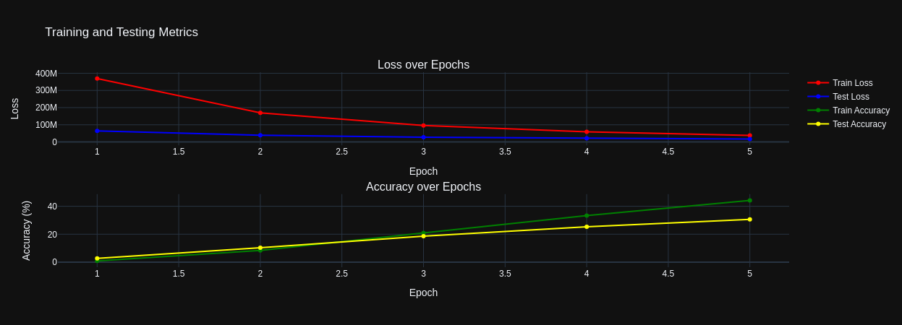
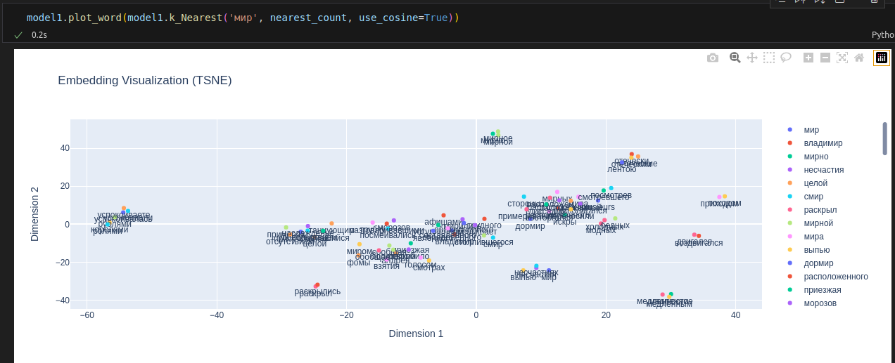

# Word and Text Embeddings

## Введение

Недавно увлекся темой эмбеддингов, и решил подробно изучить методы обучения эмбеддингов слов и текстов с их модификациями. Каждая модель написана собственно-ручно для лучшего понимания, что у них под капотом. Также будет описание за что и как отвечает каждый слой модели и особенности модели.

### Модели для обучения эмбеддингов слов:

- Word2Vec
    1) Skip-Gram
    2) CBOW
- FastText
- GloVe

### Модели для обучения эмбеддингов слов и текста одновременно:

- ELMO
- Tranformers
    1) BERT (Encoder)
    2) GPT (Decoder)
    3) T5 (Encoder + Decoder)

## Модификации класссических методов

У первой тройки реализовал такие методы, как:
1. Negative Sampling
2. Hierarhical Softmax: реализовано на сбалансированном бинарном дереве

## Цель

- Реализация всех методов в одном проекте для полного покружения в мир эмбеддингов
- Тест и изучение каждого из методов с программной, математической, философской точки зрения

## Отличие моего проекта от таких реализаций, как от nltk и тд

- Использование torch, а значит и cuda ядер
- Более читаемый код с точки зрения ООП
- Больше методов для работы с моделями и их изучения
- Описание каждой модели и их особенностей
- Описание на русском языке (возможно, потом добавлю также и на английском)

## Визуализация с помощью plotly

### Метрики

### Представление эмбеддингов на плоскости (TSNE)

## Дополнительно

- Написал свой токенизатор со всеми нужными методами
