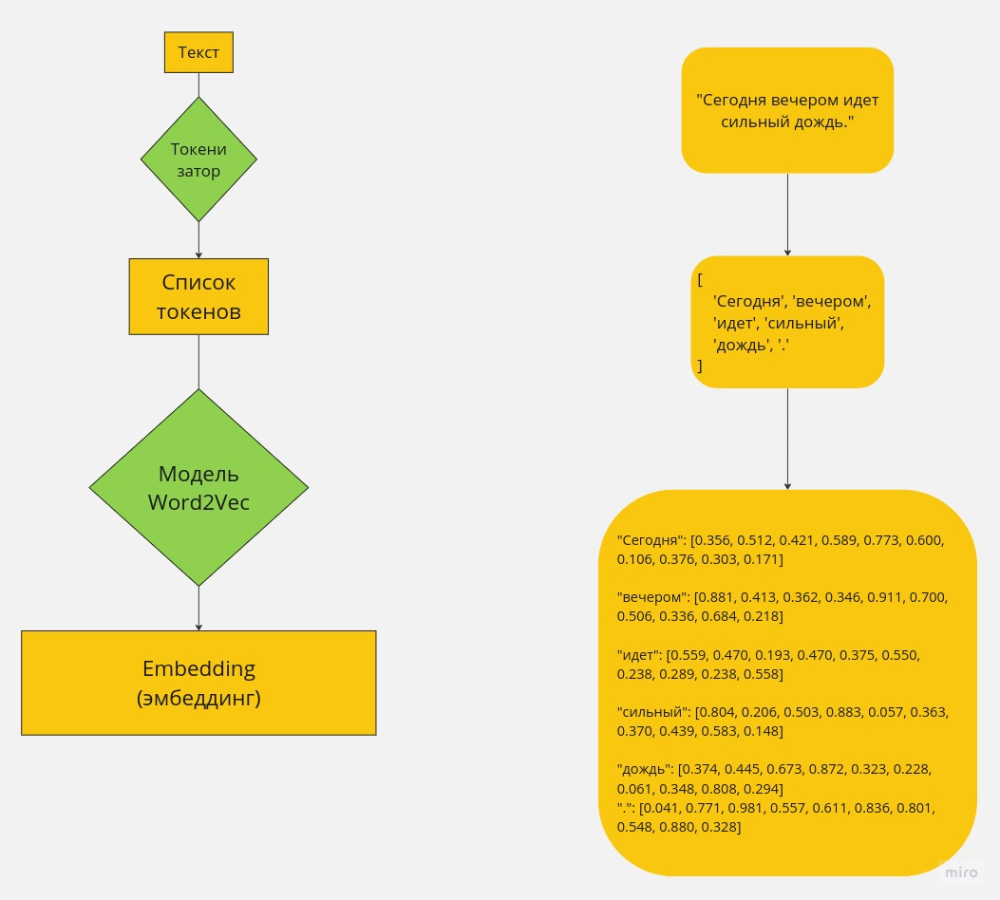
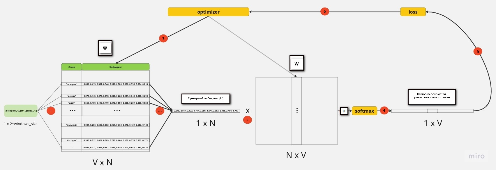

# Использование Word2Vec

## Основные понятия

### Токен

Токен - это любая сущность, которая служит строительным блоком для дальнейшего синтаксического или семантического анализа текста. Токеном может быть слово, число, знак препинания или даже отдельный символ.

### Токенизатор

Токенизатор - функция, разбивающая текст на отдельные токены. Также, важным уточнением является то, что токены идут в том же порядке, что и находились в тексте.

### Embedding(эмбеддинг)

Эмбеддинг - Векторное представление слова

## Использование готовой реализаций Word2Vec(gensim)

## Архитектура Word2Vec

### Continuous bag of words (CBOW)

#### Алгоритм или что происходит под капотом

Рассмотрим алгоритм при windows_size = 2 и при уже превращенном тексте в список токенов. Наше резутирующее слово - "сильный", тогда для его предсказания мы берем windows_size слов слева("вечером", "идет") и windows_size слов справа("дождь", "."). Также, пусть размер эмбеддинга равен N:

---

1) Для каждого из взятых слов находим эмбеддинг (h_i) из словаря W
2) Суммируем их эмбеддинги в один общий эмбеддинг (в некоторых реализациях дополнительно делят на кол-во слов)
$$h = \sum_{i=1}^{2*windows\_size} h_i$$
3) Умножаем общий эмбеддинг на матрицу весов W'
$$ u = W' h $$
4) И проводим softmax (P(w_i | context) - вероятность того, что слово \( w_i \) является целевым словом, учитывая контекст)
$$ P(w_i | \text{context}) = \frac{\exp(u_i)}{\sum_{j=1}^{V} \exp(u_j)} $$
5) Вычисляем loss, который вычисляется между ожидаемым результатом - one hot encoding для слова "сильный"(т.е. вектор состоящий из нулей и одной единицей в i позицие, соответствующей расположению слова "сильный" в словаре W) и P(w_i | context)
6) Обновляем веса в словарях W и W' с помощью оптимизатора
7) Повторяем 1-6 пункты, минимизируя loss

---

В итоге мы получаем множество эмбеддингов для различных слов (W).
