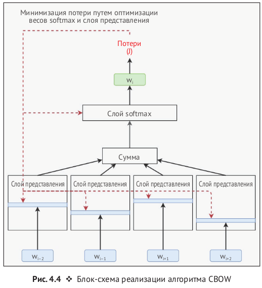

# CBOW

## Архитектура

  

## Алгоритм

### Инициализация

Пусть у нас есть словарь размером \( V \) (количество уникальных слов) и мы хотим представить каждое слово в виде вектора размером \( N \). Инициализируем две матрицы весов:

- \( W \): матрица размера \( V × N \), где каждая строка представляет вектор контекстного слова.
- \( W' \): матрица размера \( N × V \), где каждый столбец представляет вектор выходного слова.

---

### Кодирование слов

Для каждого слова в словаре существует уникальное one-hot кодированное представление. Если слово \( w \) имеет индекс \( i \) в словаре, его one-hot кодированное представление будет вектором размера \( V \), где все элементы равны 0, кроме элемента с индексом \( i \), который равен 1.

---

### Формирование вектора контекста

Для данного контекста из \( C \) слов вокруг целевого слова, берем вектора этих слов из матрицы \( W \) и усредняем их. Если \( x_1, x_2, ..., x_C \) - one-hot векторы контекстных слов, то усредненный вектор контекста \( h \) будет:

$$h = \frac{1}{C} \sum_{c=1}^{C} W^T x_c$$

где \( W^T \) - транспонированная матрица \( W \).

---

### Генерация выходного вектора

Усредненный вектор контекста \( h \) умножается на матрицу \( W' \) для получения вектора \( u \), который представляет собой предсказание модели:

$$ u = W' h $$

---

### Применение Softmax

Для преобразования вектора \( u \) в вероятностное распределение по всем словам в словаре, применяется функция softmax:

$$ P(w_i | \text{context}) = \frac{\exp(u_i)}{\sum_{j=1}^{V} \exp(u_j)} $$

где \( P(w_i | \text{context}) \) - вероятность того, что слово \( w_i \) является целевым словом, учитывая контекст.

---

### Обновление весов

Цель обучения - минимизировать ошибку между предсказанной вероятностью и истинным распределением (где истинное слово имеет вероятность 1, а все остальные - 0). Это обычно достигается через градиентный спуск, где функция потерь, например, кросс-энтропия, используется для вычисления градиентов по отношению к весам \( W \) и \( W' \).

---

### Итерации

Этот процесс повторяется множество раз для различных контекстов и целевых слов, что ведет к постепенному "обучению" матриц \( W \) и \( W' \), таким образом, что они хорошо представляют семантические отношения слов.

---

### Использование полученных векторов

После обучения векторы из \( W \) (или \( W' \), в зависимости от

 конкретной реализации) используются как представления слов в векторном пространстве.
